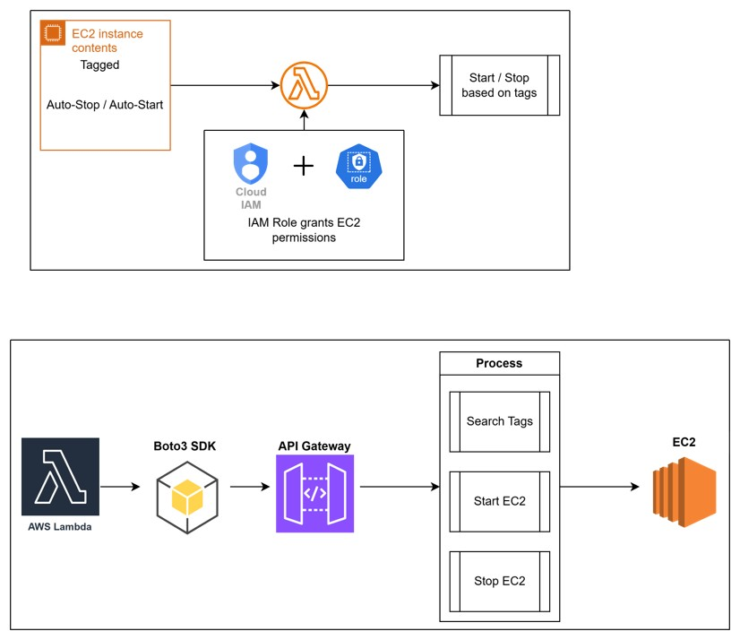

# Assignment 1: Automated Instance Management Using AWS Lambda and Boto3

## Architechture

---

## STEP 1: Create & Tag EC2 Instances
- **Navigate to:** AWS Console → EC2 → Instances → Launch Instance
- **Instance 1 (Auto-Stop)**
  1. Click **"Launch Instance"**
  2. Fill in the details:
    ```
    Name: AutoStop-Instance
    AMI: Amazon Linux 2023
    Instance type: t2.micro
    ```
    
  3. Under "Tags" section, click "Add Tag":
    ```
    Key:   Action
    Value: Auto-Stop
    ```
    
  4. Click "Launch Instance"
    
    
    
- **Instance 2 (Auto-Start)**
  1. Click **"Launch Instance"**
  2. Fill in the details:
    ```
    Name: AutoStart-Instance
    AMI: Amazon Linux 2023
    Instance type: t2.micro
    ```
    
  3. Under "Tags" section, click "Add Tag":
    ```
    Key:   Action
    Value: Auto-Start
    ```
  4. Click "Launch Instance"
    
    
    

## STEP 2: Create the IAM Policy for Lambda
- **Navigate to:** AWS Console → IAM → Policies → Create Policy
- **Steps:**
  1. Click **"Create Policy"**
  2. Service: `EC2`
  3. In **"Actions allowed"**, search for and attach:
    ```
    DescribeInstances
    StartInstances
    StopInstances
    ```
    
  4. Click **Next**, give the policy a name:
    ```
    EC2StartStop
    ```
    
  5. Click **"Create Policy"**
    

## STEP 3: Create the IAM Role for Lambda
- **Navigate to:** AWS Console → IAM → Roles → Create Role
- **Steps:**
  1. Click **"Create Role"**
  2. Trusted entity type: `AWS Service`
  3. Use case: `Lambda` → Click Next
    
  4. In **"Add permissions"**, search for and attach:
    ```
    EC2StartStop
    ```
    
  5. Click **Next**, give the role a name:
    ```
    Lambda-EC2-Manager-Role
    ```
    
  6. Click **"Create Role"**
    

## STEP 4: Create the Lambda Function
- **Navigate to:** AWS Console → Lambda → Create Function
- **Setup:**
  1. Choose **"Author from scratch"**
  2. Fill in:
    ```
    Function name: EC2-Instance-Manager
    Runtime:       Python 3.14
    ```
    
  3. Under **"Custom settings" → "Additional settings" → "General " → "Custom execution role"**:
    - Toggle select **"Custom execution role"**
    - In **"Configure custom execution role"** section that newly opened 
    - Select **"Choose an existing role"**
    - Choose `Lambda-EC2-Manager-Role`
    - Click **"Save"**
    
  4. Click **"Create Function"**
  

## STEP 5: Write the Boto3 Python Code
- In the Lambda function editor, replace all existing code with code.
  
- Click **"Deploy"** to save
  

## STEP 6: Configure Timeout
By default Lambda times out in `3 seconds`, which may be too short.
- In your Lambda function → Click **"Configuration"** tab
- Click **"General configuration" → Edit**
- Set **Timeout** to `30 seconds`
  
- Click **Save**
  

## STEP 7:  Manually Test the Lambda Function
- Check EC2 instances statuses
  
- In your Lambda function, click the **"Test"** tab
- Click **"Create new event"**:
  ```
  Invocation type: Synchronous
  Event name: ManualTest
  Template:   Hello World (just leave default JSON)
  ```
  
- Click **"Save"** then click **"Test"**
  
  
- Navigate to: EC2 → Instances
  