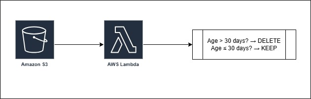

# Assignment 2: Automated S3 Bucket Cleanup Using AWS Lambda and Boto3

## Architechture

---

## STEP 1: Create & Populate the S3 Bucket
- **Navigate to:** AWS Console → S3 → Create Bucket
- **Create the Bucket:**
  1. Click **"Create Bucket"**
  2. Fill in the details:
    ```
    AWS Region: Asia Pacific (Mumbai) ap-south-1
    Bucket type: General purpose
    Bucket namespace: Global namespace
    Bucket name: my-cleanup-bucket-rishm
    ```
    
  3. Leave all other settings as default
  4. Click **"Create Bucket"**
    
- **Upload Test Files:**
  1. Open your bucket → Click **"Upload"**
  2. Upload files as required
    
    
    

## STEP 2: Create the IAM Policy for Lambda
- **Navigate to:** AWS Console → IAM → Policies → Create Policy
- **Steps:**
  1. Click **"Create Policy"**
  2. Service: `S3`
  3. In **"Actions allowed"**, search for and attach:
    ```
    ListBucket
    GetObject
    DeleteObject
    ```
    
  4. In **"Resources"** add bucket `my-cleanup-bucket-rishm`
    
  5. In **"Resources"** add object
    ```
    Resource bucket name: my-cleanup-bucket-rishm
    Resource object name: Select **"Any object name"** checkbox
    ```
    
  6. Click **Next**, give the policy a name:
    ```
    S3Cleanup
    ```
  5. Click **"Create Policy"**
    

## STEP 3: Create the IAM Role for Lambda
- **Navigate to:** AWS Console → IAM → Roles → Create Role
- **Steps:**
  1. Click **"Create Role"**
  2. Trusted entity type: `AWS Service`
  3. Use case: `Lambda` → Click Next
    
  4. In **"Add permissions"**, search for and attach:
    ```
    S3Cleanup
    CloudWatchLogsFullAccess
    ```
    
  5. Click **Next**, give the role a name:
    ```
    Lambda-S3-Cleanup-Role
    ```
    
  6. Click **"Create Role"**
    

## STEP 4: Create the Lambda Function
- **Navigate to:** AWS Console → Lambda → Create Function
- **Setup:**
  1. Choose **"Author from scratch"**
  2. Fill in:
    ```
    Function name: S3-Bucket-Cleanup
    Runtime:       Python 3.14
    ```
    
  3. Under **"Custom settings" → "Additional settings" → "General " → "Custom execution role"**:
    - Toggle select **"Custom execution role"**
    - In **"Configure custom execution role"** section that newly opened 
    - Select **"Choose an existing role"**
    - Choose `Lambda-S3-Cleanup-Role`
    - Click **"Save"**
    
  4. Click **"Create Function"**
  

## STEP 5: Write the Boto3 Python Code
- In the Lambda function editor, replace all existing code with code.

- Click **"Deploy"** to save


## STEP 6: Configure Lambda Settings
By default Lambda times out in `3 seconds`, which may be too short.
- In your Lambda function → Click **"Configuration"** tab
- Click **"General configuration" → Edit**
- Set **Memory** to `256 MB`
- Set **Timeout** to `5 minutes`

- Click **Save**


## STEP 7:  Manually Test the Lambda Function
Since uploading truly old files is tricky, so converted the code for 30 min cutoff

- Check S3 bucket
  
- In your Lambda function, click the **"Test"** tab
- Click **"Create new event"**:
  ```
  Invocation type: Synchronous
  Event name: ManualTest
  Template:   Hello World (just leave default JSON)
  ```
  
- Click **"Save"** then click **"Test"**
  
  
- Navigate to S3 bucket
  