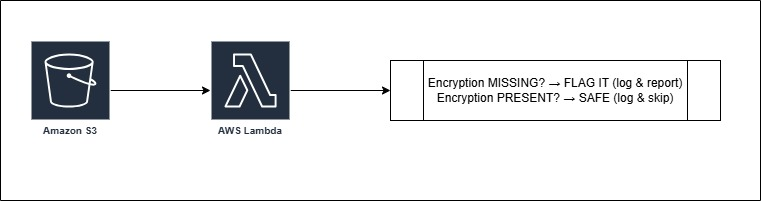

# Assignment 3: Monitor Unencrypted S3 Buckets Using AWS Lambda and Boto3

## Architechture

---

## STEP 1: Create S3 Buckets (With & Without Encryption)
- **Navigate to:** AWS Console → S3 → Create Bucket
- **Bucket 1 — NO Bucket Key (Minimum Base level encrytion will be there):**
  1. Click **"Create Bucket"**
  2. Fill in the details:
    ```
    AWS Region: Asia Pacific (Mumbai) ap-south-1
    Bucket type: General purpose
    Bucket namespace: Global namespace
    Bucket name: demo-unencrypted-bucket-01-rishm
    ```
    
  3. Scroll to **"Default encryption"** section
  4. Select **"Disable"** ← Bucket Key
    
  5. Click **"Create Bucket"**
    
- **Bucket 2 — NO Bucket Key (Minimum Base level encrytion will be there):**
  1. Click **"Create Bucket"**
  2. Fill in the details:
    ```
    AWS Region: Asia Pacific (Mumbai) ap-south-1
    Bucket type: General purpose
    Bucket namespace: Global namespace
    Bucket name: demo-unencrypted-bucket-02-rishm
    ```
    
  3. Scroll to **"Default encryption"** section
  4. Select **"Disable"** ← Bucket Key
    
  5. Click **"Create Bucket"**
    
- **Bucket 3 — WITH SSE-S3 Encryption:**
  1. Click **"Create Bucket"**
  2. Fill in the details:
    ```
    AWS Region: Asia Pacific (Mumbai) ap-south-1
    Bucket type: General purpose
    Bucket namespace: Global namespace
    Bucket name: demo-encrypted-sse-s3-rishm
    ```
    
  3. Scroll to **"Default encryption"** section
  4. **Encryption type** select `Server-side encryption with Amazon S3 managed keys (SSE-S3)`
  5. Select **"Enable"** ← Bucket Key
    
  6. Click **"Create Bucket"**
    
- **Bucket 4 — WITH SSE-KMS Encryption:**
  1. Click **"Create Bucket"**
  2. Fill in the details:
    ```
    AWS Region: Asia Pacific (Mumbai) ap-south-1
    Bucket type: General purpose
    Bucket namespace: Global namespace
    Bucket name: demo-encrypted-sse-kms-rishm
    ```
    
  3. Scroll to **"Default encryption"** section
  4. **Encryption type** select `Server-side encryption with AWS Key Management Service keys (SSE-KMS)`
  5. **AWS KMS key** select `Choose from your AWS KMS keys` choose aws default key
  6. Select **"Enable"** ← Bucket Key
    
  7. Click **"Create Bucket"**
    

## STEP 2: Create the IAM Role for Lambda
- **Navigate to:** AWS Console → IAM → Roles → Create Role
- **Steps:**
  1. Click **"Create Role"**
  2. Trusted entity type: `AWS Service`
  3. Use case: `Lambda` → Click Next
    
  4. In **"Add permissions"**, search for and attach:
    ```
    AmazonS3ReadOnlyAccess
    CloudWatchLogsFullAccess
    ```
    
  5. Click **Next**, give the role a name:
    ```
    Lambda-S3-Security-Monitor-Role
    ```
    
  6. Click **"Create Role"**
    

## STEP 3: Create the Lambda Function
- **Navigate to:** AWS Console → Lambda → Create Function
- **Setup:**
  1. Choose **"Author from scratch"**
  2. Fill in:
    ```
    Function name: S3-Encryption-Monitor
    Runtime:       Python 3.14
    ```
    
  3. Under **"Custom settings" → "Additional settings" → "General " → "Custom execution role"**:
    - Toggle select **"Custom execution role"**
    - In **"Configure custom execution role"** section that newly opened 
    - Select **"Choose an existing role"**
    - Choose `Lambda-S3-Security-Monitor-Role`
    - Click **"Save"**
    
  4. Click **"Create Function"**
  

## STEP 5: Write the Boto3 Python Code
- In the Lambda function editor, replace all existing code with code.

- Click **"Deploy"** to save


## STEP 6: Configure Lambda Settings
By default Lambda times out in `3 seconds`, which may be too short.
- In your Lambda function → Click **"Configuration"** tab
- Click **"General configuration" → Edit**
- Set **Timeout** to `1 minutes`

- Click **Save**


## STEP 7:  Manually Test the Lambda Function
- Check S3 bucket
  
- In your Lambda function, click the **"Test"** tab
- Click **"Create new event"**:
  ```
  Invocation type: Synchronous
  Event name: SecurityScanTest
  Template:   Hello World (just leave default JSON)
  ```
  
- Click **"Save"** then click **"Test"**
  
  

Not possible to re-create as currently AWS does not support creating S3 buckets without base level encryption
