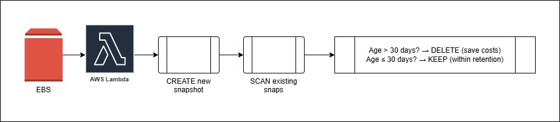

# Assignment 4: Automatic EBS Snapshot and Cleanup Using AWS Lambda and Boto3

## Architechture

---

## STEP 1: Create an EBS Volume
- **Navigate to:** AWS Console → EC2 → Elastic Block Store → Volumes
- **Steps**
  1. Click **"Create Volume"**
  2. Fill in the details:
    ```
    Volume type: gp3 (General Purpose SSD)
    Size: 1 GiB  (minimum, free-tier friendly)
    Availability Zone: aps1-az1 (ap-south-1a)
    ```
    
  3. Under "Tags" section, click "Add Tag":
    ```
    Key:   Name
    Value: Lambda-Backup-Volume
    ```
    
  4. Click "Create Volume"
  

## STEP 2: Create the IAM Policy for Lambda
- **Navigate to:** AWS Console → IAM → Policies → Create Policy
- **Steps:**
  1. Click **"Create Policy"**
  2. Service: `EC2` in **"Actions allowed"**, search for and attach:
    ```
    CreateTags
    CreateSnapshot
    DescribeSnapshots
    DescribeVolumes
    DeleteSnapshot
    ```
  3. Service: `CloudWatch Logs` in **"Actions allowed"**, search for and attach:
    ```
    CreateLogGroup
    CreateLogStream
    PutLogEvents
    ```
    
  4. Click **Next**, give the policy a name:
    ```
    EBSSnapshotPolicy
    ```
    
  5. Click **"Create Policy"**
    

## STEP 3: Create the IAM Role for Lambda
- **Navigate to:** AWS Console → IAM → Roles → Create Role
- **Steps:**
  1. Click **"Create Role"**
  2. Trusted entity type: `AWS Service`
  3. Use case: `Lambda` → Click Next
    
  4. In **"Add permissions"**, search for and attach:
    ```
    EBSSnapshotPolicy
    ```
    
  5. Click **Next**, give the role a name:
    ```
    Lambda-EBS-Snapshot-Manager-Role
    ```
    
  6. Click **"Create Role"**
    

## STEP 4: Create the Lambda Function
- **Navigate to:** AWS Console → Lambda → Create Function
- **Setup:**
  1. Choose **"Author from scratch"**
  2. Fill in:
    ```
    Function name: EBS-Snapshot-Manager
    Runtime:       Python 3.14
    ```
    
  3. Under **"Custom settings" → "Additional settings" → "General " → "Custom execution role"**:
    - Toggle select **"Custom execution role"**
    - In **"Configure custom execution role"** section that newly opened 
    - Select **"Choose an existing role"**
    - Choose `Lambda-EBS-Snapshot-Manager-Role`
    - Click **"Save"**
    
  4. Click **"Create Function"**
  

## STEP 5: Write the Boto3 Python Code
- In the Lambda function editor, replace all existing code with code.
  
- Click **"Deploy"** to save
  

## STEP 6: Configure Timeout
By default Lambda times out in `3 seconds`, which may be too short.
- In your Lambda function → Click **"Configuration"** tab
- Click **"General configuration" → Edit**
- Set **Memory** to `256 MB`
- Set **Timeout** to `5 minutes`

- Click **Save**


## STEP 7:  Manually Test the Lambda Function
- Check EBS
  
- In your Lambda function, click the **"Test"** tab
- Click **"Create new event"**:
  ```
  Invocation type: Synchronous
  Event name: SnapshotTest
  Template:   Hello World (just leave default JSON)
  ```
  
- Click **"Save"** then click **"Test"**
  
  
- EC2 → Elastic Block Store → Snapshots
  